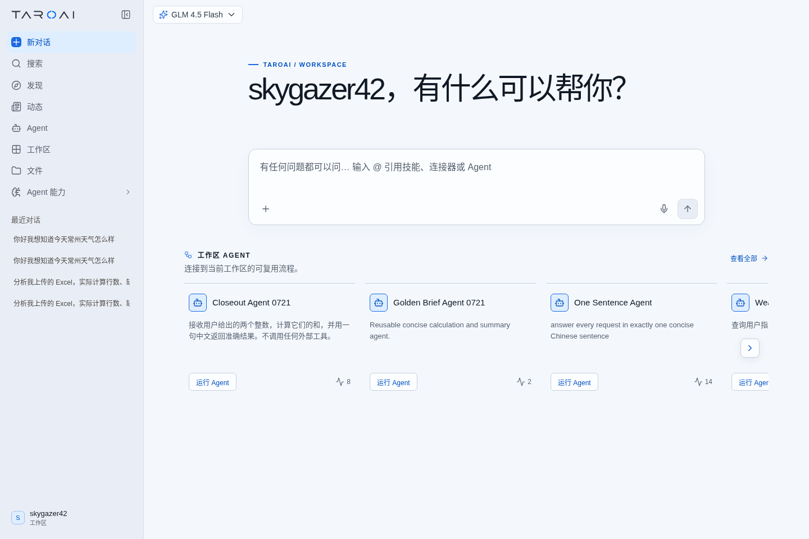
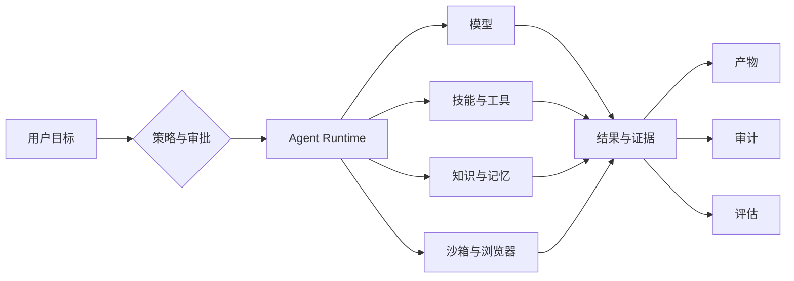
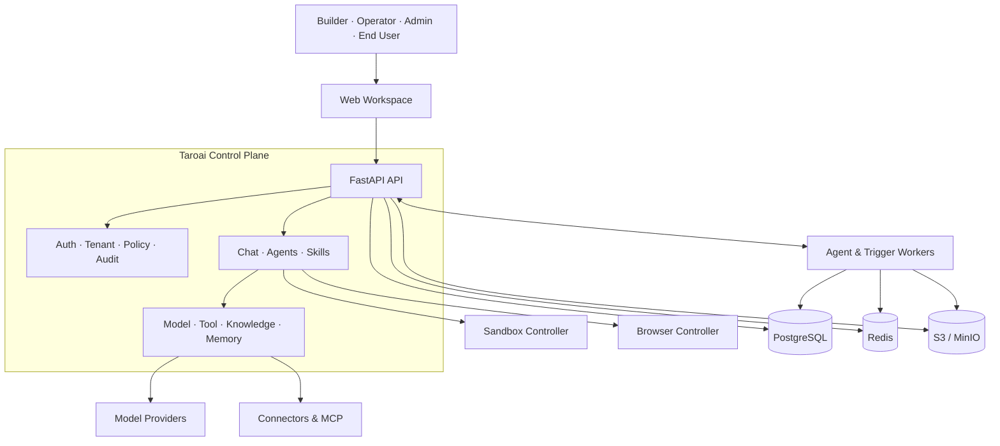

<p align="center">
  
</p>

<p align="center"><strong>把自然语言目标变成可执行、可治理、可复盘的 Agent 自动化。</strong></p>

<p align="center">
  <a href="https://www.python.org/"></a>
  <a href="https://fastapi.tiangolo.com/"></a>
  <a href="https://www.postgresql.org/"></a>
  <a href="https://redis.io/"></a>
  <a href="https://docs.docker.com/compose/"></a>
   <a href="https://github.com/skygazer42/Taroai"></a>
  <a href="https://github.com/skygazer42/Taroai/issues"></a>
</p>
 

Taroai 是面向知识工作者和小团队的云优先、多租户 Agent 工作空间。通过一个界面完成对话、联网搜索、文件处理和代码执行，并将可靠流程发布为可复用 Agent。

 

## 核心能力

| 构建 | 执行 | 治理 |
| --- | --- | --- |
| **Chat 与 Agents**<br />流式对话、模型选择、Agent 创建与发布 | **Skills 与 Tools**<br />动态工具发现、MCP、企业连接器与审批 | **身份与策略**<br />多租户、RBAC、SSO、SCIM 与 Guardrails |
| **知识与记忆**<br />文件摄取、ACL 检索、RAG 与多层记忆 | **隔离运行**<br />Sandbox、Browser、Coding Workspace 与 Artifact | **质量与运营**<br />评估门禁、审计、计费、追踪与定时调度 |

## 产品界面

模型选择、对话输入、历史会话和已发布 Agent 汇聚在同一工作区；答案优先展示，工具过程与执行证据按需展开。



## Agent 执行流程



## 快速开始

需要 Docker Engine 24+、Docker Compose 插件、8 GB 可用内存，以及一个可用的模型 Provider API Key。

```bash
cp .env.example .env
# 在 .env 中配置至少一个模型 Provider
docker compose --env-file .env -f infra/docker-compose.yml up -d --build
curl -fsS http://localhost:8000/healthz
```

| 服务 | 地址 |
| --- | --- |
| Web 工作空间 | http://localhost:3000 |
| API | http://localhost:8000 |
| MinIO 控制台 | http://localhost:9001 |

沙箱和浏览器控制器是可选组件，分别通过 `local-sandbox` 与 `local-browser` Compose profile 启用。完整配置与验证流程见[本地运行手册](docs/operations/mvp-local-cloud-poc.md)。

## 系统架构

FastAPI 控制平面负责治理和编排，Worker 执行异步任务，Sandbox / Browser Controller 提供隔离边界，PostgreSQL、Redis 与 S3/MinIO 构成数据平面。



Governance、Runtime 与 Intelligence 是 `apps/api` 内部能力模块，不是独立微服务。

## 开发与部署

### 开发与测试

```bash
pip install -r apps/api/requirements.txt
pytest
```

前端无需构建步骤，可直接预览：

```bash
cd apps/web
python3 -m http.server 3000
```

### 部署入口

| 方式 | 入口 | 场景 |
| --- | --- | --- |
| Docker Compose | `infra/docker-compose.yml` | 本地开发与集成验证 |
| 版本化 Compose | `infra/release/compose/docker-compose.release.yml` | 单节点私有化部署 |
| Kubernetes / Helm | `infra/helm/taroai/` | 生产集群与弹性伸缩 |
| 气隙交付 | `infra/release/` | 无外网或受控网络 |

生产环境应使用不可变镜像、外部 Secret 和持久化数据服务，并在升级前完成备份。参见[气隙安装](docs/operations/air-gapped-install.md)与[升级回滚](docs/operations/private-upgrade-rollback.md)。

## 参与项目

如果 Taroai 对你的 Agent 开发与自动化工作有帮助，欢迎为项目添加 Star。问题、功能建议与兼容性反馈请通过 Issues 提交。


