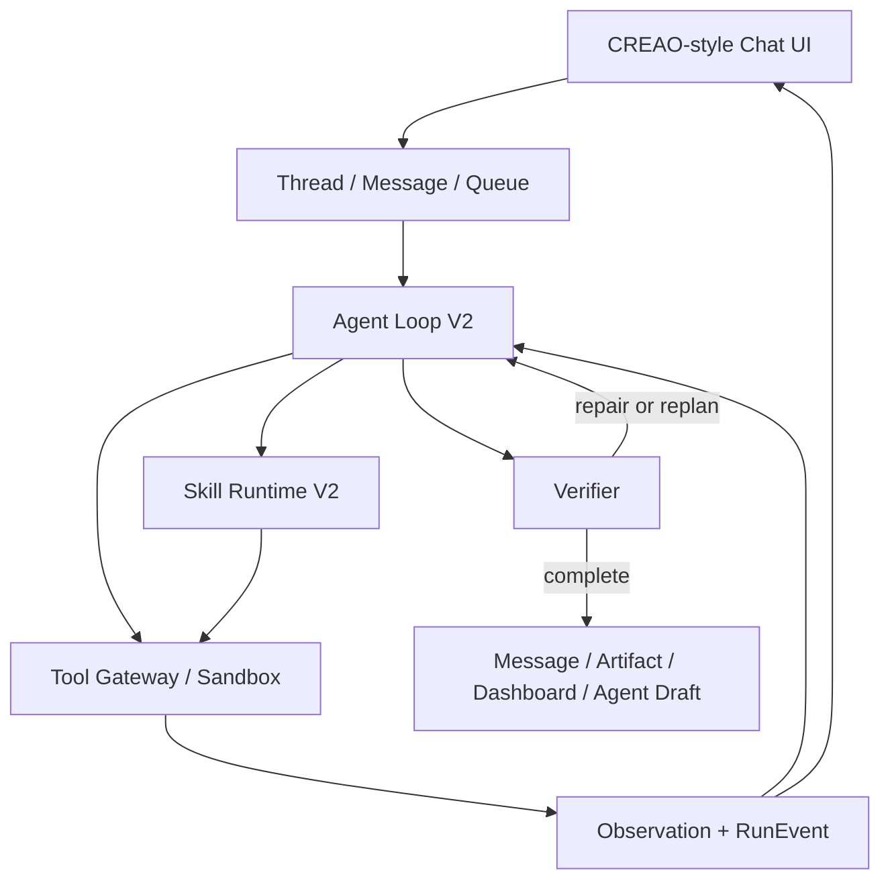

# CREAO Chat Agent Loop and Skills Product Design

**Status:** Approved  
**Approved:** 2026-07-11  
**Scope:** Full CREAO-style Chat capability parity on Taroai's existing control plane

## 1. Outcome

Taroai will turn its existing governed Run console into a real multi-turn agent product. The first product program delivers the complete Chat experience as a sequence of end-to-end vertical slices rather than as disconnected backend modules or visual placeholders.

The target user journey is:

```text
Select a workspace and a real model
-> send a message, files, or explicit @skill/@connector references
-> watch the agent repeatedly decide, act, observe, verify, and repair
-> queue or steer follow-up instructions while it works
-> inspect tools, artifacts, dashboards, files, and recovery states in Chat
-> save a successful thread as a reusable versioned Agent
```

This design supersedes the capability limitations in `2026-07-10-creao-chat-parity-design.md`, while preserving that document and the current uncommitted frontend work as the visual baseline. Model selection, Create Agent, mentions, files, and navigation may no longer remain UI-only affordances.

## 2. Grounding in the Current Product

The current source already has real foundations that should be extended rather than rewritten:

- Run creation, execution, cancellation, retry, and history.
- Ordered Run events and incremental event reads.
- Approval and rejection APIs.
- Sandbox and browser sessions, terminal output, traces, and runtime state.
- Artifact creation, object storage, preview, and download.
- Tool Gateway, Connector governance, Secret Vault, audit, and billing.
- Skill manifests, registry, Workspace installation, enable/disable, explicit invocation, scopes, and visibility.
- A partially completed CREAO-style static frontend shell in the working tree.

The principal product gaps are:

- Each message creates an unrelated Run instead of belonging to a durable multi-turn Thread.
- The runtime plans once and sequentially executes; observations never influence another model decision.
- Tool retry repeats the same call instead of producing a model-driven repair or replan.
- The visual Execution Loop is inferred from coarse statuses rather than real cycle events.
- The model selector is hard-coded and is not sent to the backend.
- `@` mentions and slash commands are placeholders.
- Skills have manifests but no portable package content, exact installed version, digest, materialization, or executable evaluation.
- Create Agent and most discovery surfaces are static.
- Local file upload, server-side message queues, steering, voice, TTS, sharing, dynamic dashboards, and reconnect cards are absent.

## 3. Product Scope

### 3.1 Included

- Durable multi-turn Chat Threads and Messages.
- Agent Loop V2: Observe, Decide, Act, Observe, Verify, Repair/Replan.
- Server-persisted message Queue, edit/delete controls, manual/automatic dispatch, and Steering.
- Stop, deterministic cancellation, refresh recovery, and immutable checkpoints.
- Real Model Provider Registry selection and per-model reasoning effort.
- Uploads, attachment chips, file references, previews, and generated-file persistence.
- Structured `@skill` and `@connector` autocomplete and resource references.
- Skill Package Runtime with `SKILL.md`, supporting files, scripts, version pinning, digest, progressive disclosure, GitHub/ZIP install, and Chat-created skills.
- Streaming cycle, tool, observation, repair, verification, and artifact UI.
- Interactive artifacts, code view, copy, download, and safe HTML preview.
- Structured dynamic dashboards.
- Create Agent from a successful Thread, Agent v1, input form, output contract, reference files, and runtime snapshot reference.
- Voice recording and transcription, assistant TTS, suggestion chips, Connector reconnect cards, and retry.
- Read-only, revocable Thread sharing, pin, rename, delete, and search.
- Existing Connector and Tool Gateway integration inside Chat.

### 3.2 Excluded from This Program

- New third-party Connector implementations beyond those already supported by Taroai.
- Codex app-server, Claude Agent SDK, or OpenCode engine adapters.
- GitHub App, remote repository cloning, Pull Requests, or a dedicated coding worktree product.
- Production claims about sandbox isolation until its separate production isolation gate passes.
- Reverse engineering or claiming CREAO's private internal planner implementation.

## 4. Delivery Strategy

Use contract-first vertical slices. Each slice includes migrations, domain models, services, API, frontend, tests, and runtime verification before the next slice begins.

1. **Thread and Loop:** multi-turn Threads, Agent Loop V2, real event stream, Queue, Steering, Stop, checkpoint recovery, and real model selection.
2. **Skills:** package storage, parsing, validation, exact version installation, discovery, progressive loading, mentions, GitHub/ZIP import, and Chat-created skills.
3. **Artifacts and Agents:** interactive artifact sidecar, dashboards, generated files, Create Agent, Agent v1, and repeat execution.
4. **Experience Completion:** voice, TTS, sharing, suggestions, Connector reconnect, thread management, and final visual/functional parity.

The legacy one-shot runtime remains available behind a feature flag during migration. New Thread execution uses Agent Loop V2. The flag is removed only after compatibility and recovery tests pass.

## 5. Architecture



### 5.1 Thread Layer

A Thread is the long-lived conversational container. It owns:

- Tenant and Workspace.
- Title, pinned state, lifecycle status, and optional public-share state.
- Provider, model, and reasoning-effort policy.
- Ordered messages, attachments, structured resource references, queued messages, and steering messages.
- The current or resumable Sandbox session.
- Runs produced by turns in the Thread.

A Run is one execution inside a Thread. Sending a normal message when no Run is active creates a Run. Sending while a Run is active creates a queued message or a steering instruction according to the user's explicit choice.

### 5.2 Agent Loop V2

The loop is explicit and persisted:

```text
Load context and budgets
-> expose summaries of enabled Skills and Connectors
-> Decide next response or action
-> load full Skill package only when selected
-> Policy and budget check
-> Execute action
-> persist Observation, event, usage, and checkpoint
-> Verify goal and output contract
-> finish, repair, replan, wait for user, or fail
```

The model never receives hidden chain-of-thought from previous cycles. It receives a structured, redacted history of user messages, decisions, tool inputs, observations, verifier feedback, applicable Skills, budgets, and steering instructions.

Completing all planned steps is not success. Only the Verifier can mark a Run successful.

### 5.3 Skill Runtime V2

The portable package shape is:

```text
skill-name/
|- SKILL.md
|- taroai.yaml          # optional Taroai governance extension
|- scripts/
|- references/
|- assets/
|- examples/
`- evals/
```

Discovery is progressive:

1. At cycle start, provide only enabled Skill identifiers, names, descriptions, and explicit resource references.
2. When the model selects a Skill, load its pinned `SKILL.md` and relevant metadata.
3. Materialize only the selected package into the Sandbox.
4. Resolve tools, Connector requirements, knowledge bindings, permissions, and runtime constraints.
5. Record the Skill ID, version, package digest, source, and evaluation suite on the action and Run.

Explicit `@skill` references constrain the decision to that Skill unless Policy rejects it. A disabled, unpublished, invisible, or uninstalled Skill can never be selected implicitly or explicitly.

### 5.4 Event Model

The existing RunEvent mechanism remains the unique execution event source. Events gain a Thread projection and monotonic `thread_sequence` so a client can resume across multiple Runs without replay ambiguity.

Required event families include:

```text
thread.message.queued
thread.message.updated
thread.message.deleted
agent.steering.requested
agent.steering.applied
agent.cycle.started
agent.decision.created
skill.selected
skill.loaded
agent.action.started
agent.action.output
agent.action.completed
agent.action.failed
agent.observation.recorded
agent.verification.completed
agent.verification.failed
agent.repair.started
agent.plan.revised
connector.reconnect_required
connector.reconnected
artifact.created
dashboard.updated
suggestion.created
agent.loop.completed
```

Payloads contain observable state and redacted inputs/outputs, never private reasoning.

## 6. Persistence Model

### 6.1 New Tables

- `chat_threads`: tenant, workspace, title, status, pinned state, provider/model/effort, Sandbox session, timestamps.
- `chat_messages`: thread, sequence, role, content, kind, dispatch status, attachments, structured resource references, timestamps.
- `agent_cycles`: run, iteration, plan revision, decision type, verifier status, budget snapshot, timestamps.
- `agent_actions`: cycle, action key, Skill/Tool reference, redacted input, result reference, failure class, usage, timing, status.
- `agent_checkpoints`: immutable version, run, cycle, last committed action, state snapshot, Sandbox checkpoint reference, checksum.
- `skill_package_files`: Skill version, normalized path, content/object reference, media type, size, digest.
- `thread_shares`: thread, hashed token, active state, expiry, created/revoked metadata.
- `agent_definitions`: stable Agent identity, owner, Workspace, visibility, current version.
- `agent_versions`: input schema, output contract, instructions, pinned Skills, model policy, runtime snapshot, reference files, evaluation suite, status.
- `agent_reference_files`: Agent version, display name, storage object, Sandbox mount path, digest.

### 6.2 Existing Table Extensions

- Runs gain `thread_id`, `trigger_message_id`, provider/model/effort resolution, active plan revision, and terminal reason.
- Run events gain `thread_id` and monotonic `thread_sequence`.
- Skill versions gain source metadata, package digest, package manifest, release notes, and executable evaluation reference.
- Skill installations gain `installed_version`, `package_digest`, resolved dependencies, and update status.
- Artifacts gain Thread/Message association, preview type, code-view capability, Dashboard schema metadata, and safe-rendering policy.

Queue state remains on `chat_messages`; a separate queue table is unnecessary. Dispatch transitions are `queued`, `steering`, `ready`, `inflight`, `completed`, `cancelled`, and `failed`.

## 7. API Contracts

Representative endpoints:

```text
POST   /api/threads
GET    /api/threads
GET    /api/threads/{thread_id}
PATCH  /api/threads/{thread_id}
DELETE /api/threads/{thread_id}

POST   /api/threads/{thread_id}/messages
PATCH  /api/threads/{thread_id}/messages/{message_id}
DELETE /api/threads/{thread_id}/messages/{message_id}
POST   /api/threads/{thread_id}/messages/{message_id}/steer
POST   /api/threads/{thread_id}/queue/dispatch
GET    /api/threads/{thread_id}/events?after_sequence=N

POST   /api/threads/{thread_id}/stop
POST   /api/threads/{thread_id}/share
DELETE /api/threads/{thread_id}/share

GET    /api/workspaces/{workspace_id}/capabilities
POST   /api/uploads
POST   /api/speech/transcriptions
POST   /api/speech/synthesis

POST   /api/skills/import/zip
POST   /api/skills/import/github
GET    /api/skills/{skill_id}/versions/{version}/files
POST   /api/threads/{thread_id}/extract-skill

POST   /api/threads/{thread_id}/agent-drafts
POST   /api/agent-drafts/{draft_id}/publish
POST   /api/agents/{agent_id}/runs
```

Every mutating endpoint uses an idempotency key. Tenant and Workspace authorization is resolved before lookup results are returned. A resource reference contains typed IDs, not only visible mention text.

## 8. Frontend Product Design

The current CREAO-style shell is retained:

```text
Left: Workspace and Thread navigation
Center: multi-turn Chat and execution stream
Right: Artifact, Dashboard, Files, and contextual detail panel
```

### 8.1 Composer

- Real provider/model selector populated from the allowed Provider Registry.
- Per-model reasoning effort persisted to the Thread.
- Text input, Enter/Shift+Enter behavior, Send/Stop state, and editable Thread draft.
- File selection and drag/drop with upload progress and attachment chips.
- Searchable `@` menu sourced from enabled Workspace Skills and connected Connectors.
- Microphone recording with waveform, timer, cancel, transcribe, and editable transcript.
- Create Agent enabled only when the Thread has a successful eligible Run.
- Unsupported slash commands are not rendered as active controls.

### 8.2 Conversation Stream

- User, assistant, queued, and steering messages.
- Thinking and Sandbox/agent lifecycle statuses.
- Collapsible Skill and Tool cards with status, duration, and expandable redacted details.
- Observation, repair, replan, verifier, approval, reconnect, and failure cards.
- Token-by-token text where the provider supports it; event-by-event status everywhere.
- Artifact chips that reopen the right panel.
- Contextual suggestion chips after completion.

### 8.3 Queue and Steering

The server-backed Queue panel supports ordered items, edit, delete, Steer now, and automatic/manual dispatch. A steering item displays that it applies after the current action. If the Run cannot accept steering, the server atomically returns it to queued state.

Closing the browser does not stop queue processing. Reopening the Thread restores the current Run, queue, streaming cursor, and draft.

### 8.4 Artifact and Dashboard Sidecar

- HTML, SVG, PDF, image, text, and code previews.
- Code view, copy source, download, and file metadata.
- Interactive HTML in an isolated iframe with a restrictive CSP and no access to Taroai cookies or host DOM.
- Dashboards are rendered from a versioned Widget Schema. Supported widgets include KPI, bar/line/area charts, tables, alerts, and progress bars.
- Model-generated arbitrary frontend JavaScript is not used to render trusted Dashboard widgets.

### 8.5 Skills Management

- Search and filter installed, built-in, and custom Skills.
- Enable/disable with immediate effect for new cycles.
- Rendered `SKILL.md` and raw view.
- Supporting file tree and syntax-highlighted source.
- ZIP upload and public GitHub URL installation with validation and progress.
- Refresh source, upgrade, rollback, and Try in Chat.
- Chat-created Skill confirmation card linked to the installed version.

### 8.6 Remaining Chat Features

- Assistant Summarize and Read Aloud with play/stop state.
- Public read-only share link creation and revocation.
- Thread search, pin, rename, and delete.
- Suggestion chips for refine prompt, connect existing Connector, or run an Agent.
- Inline Connector reconnect card; successful reconnect resumes only the failed action.
- Create Agent modal with name, description, instructions, output format, input fields, pinned Skills, files, and review-before-publish.

Every visible action must map to a real API and authoritative state. A capability that is unavailable for the current tenant is hidden or explicitly disabled with a reason; it is never left as a clickable placeholder.

## 9. Error Handling and Recovery

### 9.1 Failure Classification

| Failure | Response |
| --- | --- |
| Transient network/model limit | Exponential backoff inside the same cycle |
| Command, code, or Tool failure | Persist observation and ask the model for a different repair action |
| Invalid plan assumption | Increment plan revision and replan |
| Missing user input | Pause as `waiting_for_user` and request information in Chat |
| Expired Connector credential | Pause action, display reconnect card, resume idempotently after authorization |
| Policy or permission denial | Do not repeat; provide the allowed boundary to the next decision |
| Lost Sandbox | Restore latest checkpoint or fail with a deterministic recovery reason |
| Failed verification | Repair within budget, otherwise complete as failed/incomplete with evidence |

### 9.2 Budgets

Every Run has explicit maximums for:

- Iterations and repair attempts.
- Model calls, input/output tokens, and cost.
- Elapsed time and Sandbox compute time.
- Tool output and Artifact size.
- Context size and compaction count.

Crossing a limit emits one deterministic terminal event and stops execution.

### 9.3 Checkpoint and Idempotency

- Every action has a stable action key.
- The action result, observation, event, usage, and immutable checkpoint are committed atomically where possible.
- External side effects use Tool Gateway idempotency keys.
- Recovery never repeats a committed action.
- Stop cancels the active command where supported, persists state, and emits `run.cancelled`.
- Steering is consumed only at an action boundary.

## 10. Security Boundaries

- Full Auto is available only when the runtime proves it is inside a healthy isolated Sandbox. It is automatically disabled for host/in-process fallback execution.
- Sandbox-internal files, commands, and dependency installation may run automatically. Host access, long-lived credentials, Connector writes, and external side effects remain subject to Policy.
- ZIP and GitHub Skill imports enforce archive size, file count, normalized paths, allowed layout, and content limits; reject path traversal, absolute paths, device files, and unsafe links.
- Skill scripts execute only inside the Sandbox. Package source and digest are recorded for audit and reproduction.
- Connector secrets remain in the Secret Vault and are exposed only through scoped leases or the Tool Gateway.
- Artifact HTML uses a separate origin, CSP, and sandboxed iframe. It cannot read Taroai session data or host DOM.
- Share tokens are random, stored as hashes, read-only, revocable, and exclude secret-bearing internal event fields.
- Raw voice audio uses short-lived storage and is deleted according to policy after transcription.

## 11. Testing and Acceptance

### 11.1 Test Layers

1. **State-machine unit tests:** cycle transitions, repair/replan, budgets, steering, queue ordering, cancellation, verifier, and idempotency.
2. **Skill tests:** parsing, package digest, version pinning, safe import, discovery, explicit mentions, materialization, and input/output contracts.
3. **API/database integration:** real PostgreSQL, Redis, object storage, and Docker Sandbox for Threads, events, checkpoints, artifacts, shares, reconnect, and Agent Drafts.
4. **Browser end-to-end:** Composer, model selection, attachments, Queue/Steer/Stop, refresh recovery, Tool cards, artifacts, Dashboard, voice/TTS, sharing, Skills, reconnect, and Create Agent.
5. **Visual regression:** desktop and mobile comparison to the live CREAO page or official reference screenshots; target score at least 90 plus zero functional failures in the tested interaction map.

### 11.2 Mandatory Repair Scenario

```text
First command fails
-> observation is persisted and rendered
-> the second model request includes the redacted failure
-> the model creates a different repair action
-> the action succeeds
-> the verifier passes
-> the resulting artifact is interactively previewable
```

A repeated identical Tool call does not satisfy this scenario.

### 11.3 Additional Mandatory Scenarios

- Natural language selects an appropriate Skill; `@skill` forces selection; disabled Skill is unavailable.
- Provider/model/effort selected in the UI is fixed on the Thread and used by the Run.
- Queue processing survives browser closure and refresh.
- Steering affects the same Run at a safe boundary.
- Checkpoint recovery does not repeat a committed Tool action.
- Voice can record, transcribe, edit, and send; TTS can play and stop.
- Share links are read-only, revocable, and redact internal secret-bearing details.
- Connector reconnect retries exactly the failed action once.
- A successful Thread creates Agent v1, and Agent v1 can run again with structured inputs.

### 11.4 Completion Gate

- Full lint, type checking, static analysis, and pytest suite pass.
- Migrations and Docker integration tests pass in the formal Builder environment.
- No active control is backed only by local state or placeholder prompt insertion.
- No unhandled browser console errors in core journeys.
- No known P0 or P1 defects in the approved scope.
- Each slice carries automated evidence; screenshots alone are insufficient.

## 12. Migration and Compatibility

- Preserve existing Runs and operational APIs while adding optional Thread association.
- Existing Runs without a Thread remain visible in Operations and may be imported into read-only compatibility Threads if needed.
- Preserve existing Artifact and storage object identifiers.
- Extend Skill records in place and migrate current installations to an explicitly resolved current version and digest.
- Keep the existing frontend work and move real behavior behind its current controls rather than recreating the visual shell.
- Keep the legacy runtime feature flag until Thread, recovery, and one-shot compatibility tests pass.

## 13. Primary Risks

- The scope is intentionally large. Vertical-slice gates are mandatory to prevent a long period of partially connected UI.
- Current Sandbox isolation is not yet production-grade. Full Auto must be capability-gated rather than assumed.
- Provider streaming and speech capabilities vary. UI capability discovery must come from backend contracts.
- Live CREAO access may be intermittently unavailable. Preserve reference screenshots and extraction metadata when access succeeds; use official documentation only as a fallback.
- Current frontend changes are uncommitted user work. Implementation must preserve them and stage files deliberately.

## 14. Decision Summary

- Deliver full CREAO Chat capability scope, not only Agent Loop and Skills.
- Reuse existing Connector/Tool Gateway; do not build a new Connector catalog in this program.
- Use contract-first vertical slices.
- Make Thread, RunEvent, Agent Loop V2, and Skill Package Runtime the product core.
- Keep full automation inside a verified Sandbox while retaining policy at external boundaries.
- Do not implement external Agent Engines in this program.

